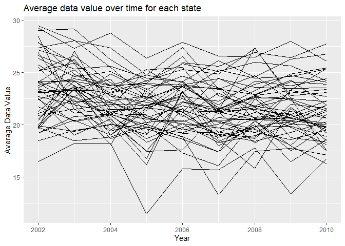
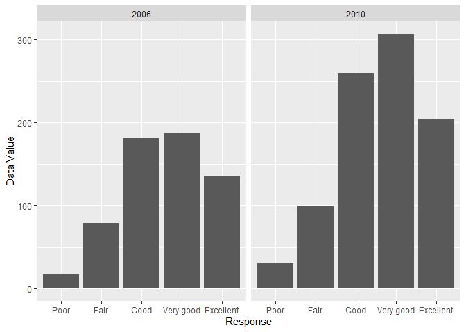
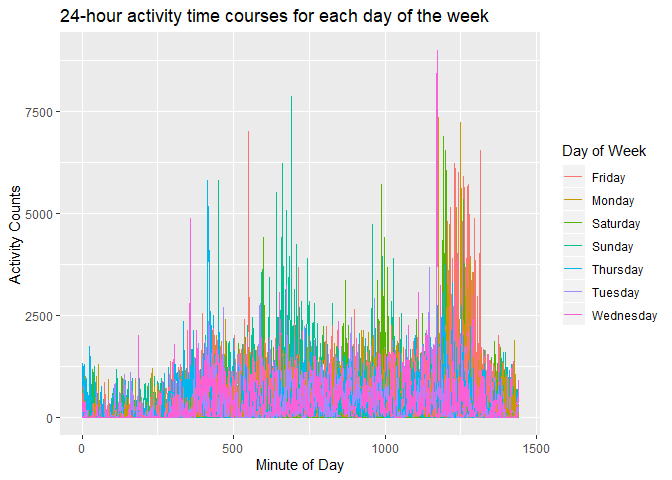

p8105\_HW3\_rat2134
================
Robert Tumasian
10/8/2019

# Homework 3

``` r
#Load required packages
library(tidyverse)
library(ggplot2)
library(dplyr)
library(knitr)
library(p8105.datasets)
library(janitor)
```

## Problem 1

``` r
#Load dataset
data("instacart")
```

The `instacart` dataset contains information on grocery purchases of
131209 unique online users. The dataset contains 1384617 products from a
particular order and 15 variables:

  - Order identifier (`order_id`, integer vector)
  - Product identifier (`product_id`, integer vector)
  - Order each product was added to cart (`add_to_cart_order`, integer
    vector)
  - Ordered previously by user (`reordered`, integer vector) \[1 = Yes,
    0 = No\]
  - Customer identifier (`user_id`, integer vector)
  - Evaluation set in which the observation is located (`eval_set`,
    character vector) \[all observations in this dataset are from the
    training set\]
  - Order sequence number (`order_number`, integer vector) \[1 = first
    order placed by user, n = n’th order placed by user\]
  - Day of the week the order was placed (`order_dow`, integer vector)
    \[0 = Sunday, 6 = Saturday\]
  - Hour of the day the order was placed (`order_hour_of_day`, integer
    vector) \[0 = 12 - 12:59 am, 23 = 11 - 11:59 pm\]
  - Days since last order (`days_since_prior_order`, integer vector)
    \[If user only has one order recorded, `days_since_prior_order` =
    `NA`\]
  - Product name (`product_name`, character vector)
  - Aisle identifier (`aisle_id`, integer vector)
  - Department identifier (`department_id`, integer vector)
  - Aisle name (`aisle`, character vector)
  - Department name (`department`, character vector)

We can interpret each row of the `instacart` dataset. For instance,
consider the first row of the dataset. We can see that order \#4 of user
\#112108 was completed on a Wednesday (`order_dow` = 4) between 10 am
and 11 am (`order_hour_of_day` = 10). Item \#1 added to this user’s
order was Bulgarian Yogurt (`product_id` = \#49302), from the yogurt
aisle (aisle \#120) in the ‘dairy eggs’ department (`department_id` =
\#16). This order was completed 9 days after the user’s previous order
(order \#3). This user has ordered this product previously (`reordered`
= 1).

We can interpret each remaining row of the dataset in a similar way to
obtain further information regarding the purchases of users over time.

There are a total of 134 aisles. The top three aisles in which the most
items are ordered from are:

1.  Fresh vegetables
2.  Fresh fruits
3.  Packaged vegetables fruits

<!-- end list -->

``` r
#Top three aisles where most items are ordered from
instacart %>%
  group_by(aisle) %>%
  count(aisle) %>%
  arrange(-n) %>%
  .[1:3,] %>%
  rename("Aisle" = aisle,
         "Number of Items Ordered" = n) %>%
  knitr::kable()
```

| Aisle                      | Number of Items Ordered |
| :------------------------- | ----------------------: |
| fresh vegetables           |                  150609 |
| fresh fruits               |                  150473 |
| packaged vegetables fruits |                   78493 |

``` r
#Plot showing the number of items ordered from each aisle
instacart %>%
  group_by(aisle, department) %>%
  count(aisle) %>%
  filter(n > 10000) %>%
  ggplot(aes(x = reorder(aisle, -n), y = n)) +
    geom_bar(stat="identity") +
    labs(
      title = "Number of items ordered from each aisle",
      x = "Aisle",
      y = "Number of Items Ordered",
      fill = "Department") +
    coord_flip()
```

<!-- -->

Here, we can also see that the most items are ordered from the `fresh
vegetables`, `fresh fruits`, and `packaged vegetables fruits` aisles.
All three of these aisles are part of the produce department.

``` r
#Table showing the three most popular items in the 'baking ingredients' aisle
BAKING_INGRED_three_most_popular_items = 
  instacart %>%
    filter(aisle == "baking ingredients") %>%
    select(c(aisle, product_name)) %>%
    count(aisle, product_name) %>%
    arrange(-n) %>%
    .[1:3,] %>%
    rename("Aisle" = aisle,
           "Product Name" = product_name,
           "Number Ordered" = n)

#Table showing the three most popular items in the 'dog food care' aisle
DOG_FOOD_CARE_three_most_popular_items = 
  instacart %>%
    filter(aisle == "dog food care") %>%
    select(c(aisle, product_name)) %>%
    count(aisle, product_name) %>%
    arrange(-n) %>%
    .[1:3,] %>%
    rename("Aisle" = aisle,
           "Product Name" = product_name,
           "Number Ordered" = n)

#Table showing the three most popular items in the 'dog food care' aisle
PACKAGED_VEG_FRUITS_three_most_popular_items = 
  instacart %>%
    filter(aisle == "packaged vegetables fruits") %>%
    select(c(aisle, product_name)) %>%
    count(aisle, product_name) %>%
    arrange(-n) %>%
    .[1:3,] %>%
    rename("Aisle" = aisle,
           "Product Name" = product_name,
           "Number Ordered" = n)

#Merging the three tables above
Three_most_popular_items_in_aisles = 
  bind_rows(BAKING_INGRED_three_most_popular_items,
            DOG_FOOD_CARE_three_most_popular_items,
            PACKAGED_VEG_FRUITS_three_most_popular_items)

knitr::kable(Three_most_popular_items_in_aisles)
```

| Aisle                      | Product Name                                  | Number Ordered |
| :------------------------- | :-------------------------------------------- | -------------: |
| baking ingredients         | Light Brown Sugar                             |            499 |
| baking ingredients         | Pure Baking Soda                              |            387 |
| baking ingredients         | Cane Sugar                                    |            336 |
| dog food care              | Snack Sticks Chicken & Rice Recipe Dog Treats |             30 |
| dog food care              | Organix Chicken & Brown Rice Recipe           |             28 |
| dog food care              | Small Dog Biscuits                            |             26 |
| packaged vegetables fruits | Organic Baby Spinach                          |           9784 |
| packaged vegetables fruits | Organic Raspberries                           |           5546 |
| packaged vegetables fruits | Organic Blueberries                           |           4966 |

We can see that the most ordered baking ingredients are light brown
sugar, pure baking soda, and cane sugar. Similarly, the top three most
ordered items in the ‘dog food care’ and ‘packaged vegetables fruits’
aisles are provided in the table above. We can also see that packaged
fruits and vegetables are ordered much more than dog food and baking
ingredients.

``` r
#Table showing the mean hour of the day at which Pink Lady Apples and Coffee Ice Cream are ordered on each day of the week
instacart %>%
  filter(product_name == c("Pink Lady Apples", "Coffee Ice Cream")) %>%
  select(c(order_hour_of_day, order_dow, product_name)) %>%
  group_by(order_dow, product_name) %>%
  summarize(round(mean(order_hour_of_day), digits = 2)) %>%
  pivot_wider(names_from = product_name,
              values_from = "round(mean(order_hour_of_day), digits = 2)") %>%
  ungroup() %>%
  mutate(order_dow =
           recode(order_dow,
                  "0" = "Sunday", "1" = "Monday", "2" = "Tuesday", 
                  "3" = "Wednesday","4" = "Thursday", "5" = "Friday", 
                  "6" = "Saturday")) %>%
  rename("Day of Week" = order_dow) %>%
  knitr::kable()
```

| Day of Week | Coffee Ice Cream | Pink Lady Apples |
| :---------- | ---------------: | ---------------: |
| Sunday      |            13.22 |            12.25 |
| Monday      |            15.00 |            11.68 |
| Tuesday     |            15.33 |            12.00 |
| Wednesday   |            15.40 |            13.94 |
| Thursday    |            15.17 |            11.91 |
| Friday      |            10.33 |            13.87 |
| Saturday    |            12.35 |            11.56 |

We can see that, on average, users order both Coffee Ice Cream and Pink
Lady Apples at the latest time of the day on Wednesdays between 3-4 pm
and 1-2 pm, respectively. In addition, on average, users order Coffee
Ice Cream and Pink Lady Apples at the earliest time of the day on
Fridays between 10-11 am and Saturdays between 11am-12 pm, respectively.

## Problem 2

``` r
#Load dataset
data("brfss_smart2010")

#Cleaning
brfss_smart2010_TIDY = 
  brfss_smart2010 %>%
    janitor::clean_names() %>%
    rename(state = "locationabbr",
           county = "locationdesc", 
           geo_coordinates = "geo_location",
           resp_id = "respid") %>%
    mutate(county = str_replace(string = county, 
                                pattern = ".*-", 
                                replacement = "")) %>%
    filter(topic == "Overall Health",
           response %in% c("Poor", "Fair", "Good", "Very good", "Excellent")) %>%
    mutate(response = factor(response,
                             levels = c("Poor", "Fair", "Good", "Very good", "Excellent"),
                             ordered = TRUE))
```

``` r
#States observed at 7+ locations in 2002
brfss_smart2010_TIDY %>%
  filter(year == 2002) %>%
  select(county, state) %>%
  distinct() %>%
  count(state, sort = TRUE) %>%
  filter(n >= 7) %>%
  rename(State = state,
         "Number of Counties" = n) %>%
  knitr::kable()
```

| State | Number of Counties |
| :---- | -----------------: |
| PA    |                 10 |
| MA    |                  8 |
| NJ    |                  8 |
| CT    |                  7 |
| FL    |                  7 |
| NC    |                  7 |

``` r
#States observed at 7+ locations in 2010
brfss_smart2010_TIDY %>%
  filter(year == 2010) %>%
  select(county, state) %>%
  distinct() %>%
  count(state, sort = TRUE) %>%
  filter(n >= 7) %>%
  rename(State = state, 
         "Number of Counties" = n) %>%
  knitr::kable()
```

| State | Number of Counties |
| :---- | -----------------: |
| FL    |                 41 |
| NJ    |                 19 |
| TX    |                 16 |
| CA    |                 12 |
| MD    |                 12 |
| NC    |                 12 |
| NE    |                 10 |
| WA    |                 10 |
| MA    |                  9 |
| NY    |                  9 |
| OH    |                  8 |
| CO    |                  7 |
| PA    |                  7 |
| SC    |                  7 |

From the two tables above, we can see that at least 7 counties in
Pennsylvania, Massachusetts, New Jersey, Connecticut, Florida, and North
Carolina were observed in 2002, in which Pennsylvania had the highest
number of counties observed. In 2010, at least 7 counties were observed
in 14 states: Florida, New Jersey, Texas, California, Maryland, North
Carolina, Nebraska, Washington, Massachusetts, New York, Ohio, Colorado,
Pennsylvania, and South Carolina, in which Florida had the highest
number of counties observed.

``` r
brfss_smart2010_TIDY %>%
  filter(response == "Excellent") %>%
  group_by(year, state) %>%
  summarize(average_data_value = mean(data_value)) %>%
  ggplot(aes(x = year, y = average_data_value, group = state)) +
    geom_line() +
    labs(
      title = "Average data value over time, by state",
      x = "Year",
      y = "Average Data Value")
```

<!-- -->

From the plot above, we can see that the average data values in all 50
states fall in the interval (10,30) from 2002-2010.

``` r
#Two-panel plot showing distribution of 'data_value' for responses in NY
brfss_smart2010_TIDY %>%
  filter(state == "NY",
         year %in% c(2006, 2010)) %>%
  select(year, data_value, response) %>%
  ggplot(aes(x = response, y = data_value)) +
  geom_bar(stat = "identity") +
  facet_grid(~year) +
  labs(
    x = "Response",
    y = "Data Value")
```

<!-- -->

From the two-panel plot above, we can see that the “Very good” response
had the highest data value among counties in NY in both 2006 and 2010.
Similarly, the “Poor” response had the lowest data value in both years.
Additionally, the data values for each response category increase from
2006 to 2010.

## Problem 3

``` r
#Load data
accel_data = read_csv("./HW3_Dataset/Accel_data.csv")

#Cleaning
accel_data_TIDY = 
  accel_data %>%
    janitor::clean_names() %>%
    rename("day_of_study" = day_id,
           "week_of_study" = week,
           "day_of_week" = day) %>%
    pivot_longer(
      activity_1:activity_1440,
      names_to = "minute_of_day",
      values_to = "activity_counts") %>%
    mutate(minute_of_day = str_replace(string = minute_of_day, 
                                       pattern = ".*_", 
                                       replacement = "")) %>%
    mutate(weekend = ifelse(day_of_week %in% c("Saturday", "Sunday"), 1, 0)) %>%
    mutate(minute_of_day = as.numeric(minute_of_day))
```

The `accel_data_TIDY` dataset represents daily accelerometer data, by
minute, for an individual in the study. There are 50400 observations and
6 variables:

  - Week of the study (`week_of_study`, numeric vector) \[1-5 weeks\]
  - Day of the study (`day_of_study`, numeric vector) \[1-35 days\]
  - Day of the week (`day_of_week`, character vector)
    \[Sunday-Saturday\]
  - Minute of the day (`minute_of_day`, numeric vector) \[1-1440
    minutes\]
  - Activity counts (`activity_counts`, numeric vector)
  - Weekend or weekday (`weekend`, numeric vector) \[0 = weekday, 1 =
    weekend\]

<!-- end list -->

``` r
accel_data_TIDY %>%
  group_by(day_of_study) %>%
  summarize(total_activity = sum(activity_counts)) %>%
  rename("Day of Study" = day_of_study,
         "Total Activity" = total_activity) %>%
  knitr::kable()
```

| Day of Study | Total Activity |
| -----------: | -------------: |
|            1 |      480542.62 |
|            2 |       78828.07 |
|            3 |      376254.00 |
|            4 |      631105.00 |
|            5 |      355923.64 |
|            6 |      307094.24 |
|            7 |      340115.01 |
|            8 |      568839.00 |
|            9 |      295431.00 |
|           10 |      607175.00 |
|           11 |      422018.00 |
|           12 |      474048.00 |
|           13 |      423245.00 |
|           14 |      440962.00 |
|           15 |      467420.00 |
|           16 |      685910.00 |
|           17 |      382928.00 |
|           18 |      467052.00 |
|           19 |      371230.00 |
|           20 |      381507.00 |
|           21 |      468869.00 |
|           22 |      154049.00 |
|           23 |      409450.00 |
|           24 |        1440.00 |
|           25 |      260617.00 |
|           26 |      340291.00 |
|           27 |      319568.00 |
|           28 |      434460.00 |
|           29 |      620860.00 |
|           30 |      389080.00 |
|           31 |        1440.00 |
|           32 |      138421.00 |
|           33 |      549658.00 |
|           34 |      367824.00 |
|           35 |      445366.00 |

From the table above, we can see that the subject had the least amount
of activity on days 24 and 31, and these are both Saturdays. The subject
had the most amount of activity on day 16, which is a Monday.

``` r
#Single-panel plot that shows the 24-hour activity time courses for each day, by day of the week
accel_data_TIDY %>%
  ggplot(aes(x = minute_of_day, 
             y = activity_counts, 
             group = day_of_study, 
             color = day_of_week)) +
  geom_line() +
  labs(
    title = "24-hour activity time courses for each day",
    x = "Minute of Day",
    y = "Activity Counts",
    color = "Day of Week")
```

<!-- -->

From the plot above, we can see that the subject tends to have the
lowest activity in the beginning of the day (0-250 minutes) and the
highest activity later in the day (1125 - 1375 minutes) for each day of
the week. However, the subject has some peaks of high activity during
some days between 300-750 minutes.
